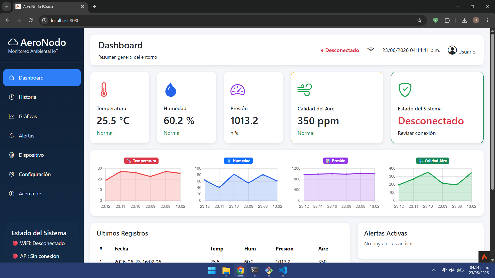
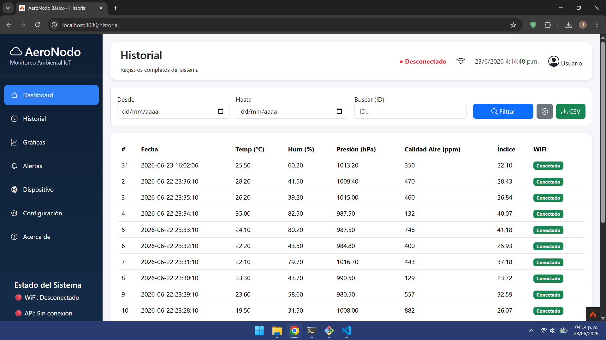
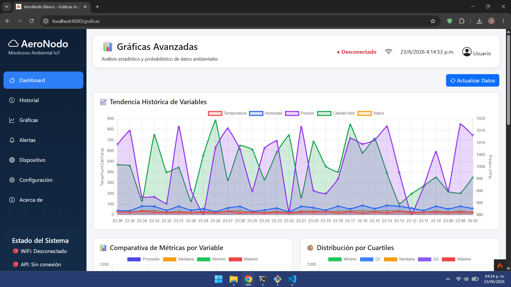
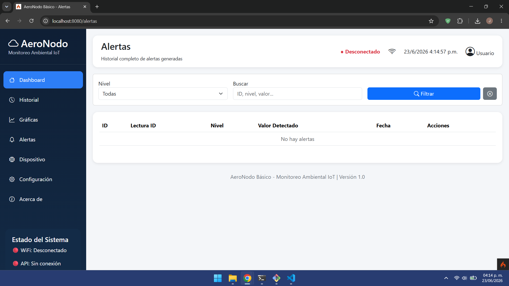

# 🌤️ AeroNodo Básico

Sistema IoT de monitoreo ambiental para espacios cerrados (aulas, hogares, oficinas) basado en ESP32, sensores BME280 y MQ-135, y un dashboard web en CodeIgniter 4 con gráficas en tiempo real.

## 📌 Descripción del problema

Actualmente, muchos espacios cerrados carecen de sistemas accesibles para monitorear temperatura, humedad, presión y calidad del aire. Esto dificulta la detección temprana de condiciones incómodas o contaminadas. Este proyecto ofrece una solución de bajo costo y fácil implementación.

## 🎯 Objetivo

Diseñar e implementar un sistema IoT que mida variables ambientales, las envíe a una API REST, las almacene en una base de datos y las visualice en un dashboard web con indicadores visuales y alertas.

## 🛠️ Tecnologías utilizadas

- **Hardware:** ESP32, BME280, MQ-135, LED RGB.
- **Backend:** CodeIgniter 4, PHP, MySQL, `hi-folks/statistics`.
- **Frontend:** Bootstrap 5, Apache ECharts, Vite.
- **Comunicación:** WiFi, HTTP, JSON.

## 📡 Sensores y actuadores

| Componente | Función |
|------------|---------|
| **ESP32** | Microcontrolador principal |
| **BME280** | Mide temperatura, humedad y presión atmosférica |
| **MQ-135** | Detecta calidad del aire (contaminantes) |
| **LED RGB** | Indica estado de conexión y calidad del aire |

## 🖥️ Capturas del Dashboard






> *Las capturas se encuentran en la carpeta `docs/`.*

## 🏗️ Diagrama de Arquitectura
ESP32 (sensores) → HTTP POST → API REST (CodeIgniter) → MySQL
↓
Dashboard Web (ECharts) ← fetch() ← API

text

## 🚀 Instrucciones de instalación

### 1. Clonar el repositorio
```bash
git clone https://github.com/JoelMurillo03/AeroNodo-Basico.git
cd aeronodo-iot/server
2. Configurar base de datos
Crea una base de datos MySQL (ej. aeronodo_db).

Copia el archivo env a .env y ajusta las credenciales de la base de datos.

Ejecuta las migraciones y seeders:

bash
composer install
php spark migrate
php spark db:seed LecturasSeeder
3. Instalar dependencias y compilar assets
bash
npm install
npm run build
4. Iniciar el servidor
bash
php spark serve
El servidor estará disponible en http://localhost:8080.

5. Cargar el código en el ESP32
Abre el archivo esp32/aeronodo.ino en el Arduino IDE.

Ajusta las credenciales WiFi y la IP del servidor.

Conecta los componentes según el esquema electrónico (ver diagrams/esquema_electronico.png).

Carga el sketch en el ESP32.

6. Acceder al dashboard
Abre tu navegador en http://localhost:8080 y observa los datos en tiempo real.

📁 Estructura del repositorio
server/: Código del backend (CodeIgniter 4).

esp32/: Código del firmware.

diagrams/: Diagramas del sistema.

README.md: Este archivo.

📄 Licencia
MIT

text

---

## 📄 5. `.gitignore`

**Archivo:** `.gitignore`
CodeIgniter
server/vendor/
server/writable/
server/.env
server/public/assets/

Node
server/node_modules/
server/package-lock.json

Logs
*.log
.DS_Store

IDE
.vscode/
.idea/

text

---